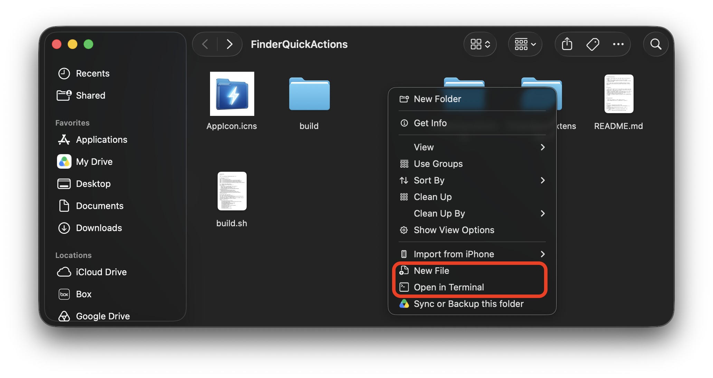
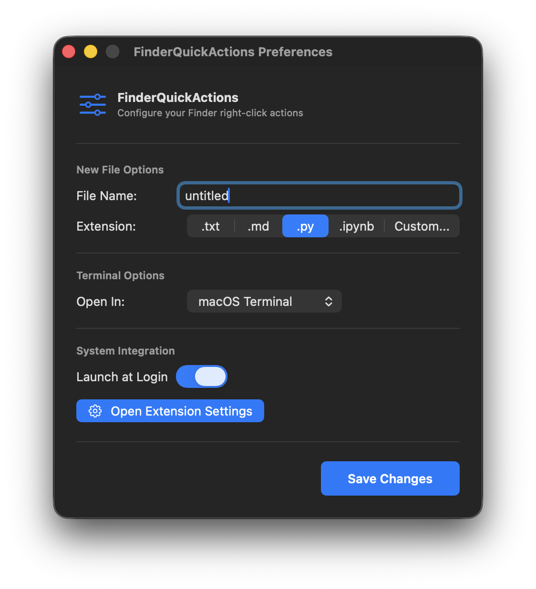

# FinderQuickActions

A macOS tool that adds right-click actions to Finder:
- **New File** (creates a file in the current folder)
- **Open in Terminal** (opens the folder in Terminal, VS Code, or Antigravity IDE)

I built this after switching from Windows because I missed basic context menu options that macOS Finder doesn't have by default.



---

## Features

- **New File**: Right-click in any folder to create a new file (e.g. `.txt`, `.md`, `.py`, or custom). Avoids name collisions automatically (`Untitled_1.txt`, etc.).
- **Open in Terminal**: Right-click to open the current path in Terminal, Visual Studio Code, or Antigravity IDE.
- **Menu Bar App**: Configure default file names, extensions, and target terminal app from the menu bar.
- **Launch at Login**: Optional setting to start automatically on login.

---

## Requirements

- macOS 14.0 (Sonoma) for pre-compiled app or newer (Apple Silicon)
- Xcode Command Line Tools (`xcode-select --install`) for compiling from source

---

## Install

### Option 1: Download Pre-compiled App
1. Download `FinderQuickActions.zip` from [Releases](https://github.com/pratiman-de/FinderQuickActions/releases).
2. Unzip and move `FinderQuickActions.app` to your `/Applications` folder.
3. If macOS blocks it from opening (quarantine), run:
   ```bash
   xattr -cr /Applications/FinderQuickActions.app
   ```

### Option 2: Build from Source
```bash
./build.sh
```
This compiles the app and extension, signs them locally, and installs `FinderQuickActions.app` to `/Applications`.

---

## Setup

1. Launch the app:
   ```bash
   open /Applications/FinderQuickActions.app
   ```
   (or just open it from `/Applications`)
2. Enable the extension:
   - Go to **System Settings** -> **Extensions** -> **Finder Extensions**.
   - Check **FinderQuickActions**.
3. Restart Finder:
   - `Option`+r`ight-click` the **Finder** icon in the Dock and click **Relaunch** (or run `killall Finder`).

---

## Configuration



Click the menu bar icon to adjust:
- Default file name prefix (default: `Untitled`)
- Default extension (`txt`, `md`, `py`, `ipynb`, or custom)
- Default editor/terminal (`Terminal`, `Visual Studio Code`, `Antigravity IDE`)
- Launch at login

Settings are stored at `~/.finder_quick_actions.json`.

---

## License

MIT
